# OPTIVIR CRM — Complete Enterprise UI Architecture & Functional Map

> **Suite Version**: Enterprise Suite v4.8  
> **Framework**: Next.js 16 (Turbopack) • TypeScript • Tailwind CSS  
> **Design Theme**: Dark Navy (`#0A1628`), Crimson (`#B91C1C`), Slate (`#E2E6EC`, `#152238`)

---

## Visual Architecture Blueprint I: Global Application Shell & 70/30 Viewport

```text
┌────────────────────────────────────────────────────────────────────────────────────────────────────────┐
│ [OPTIVIR]    [🔍 Omnisearch (Ctrl + K)...]            [📅 Oct 2026] [👥 All Teams] [🔔 7] [+ New] [AM] │
├──────────────────┬─────────────────────────────────────────────────────────────────────────────────────┤
│ 256px SIDEBAR    │ MAIN VIEWPORT CONTAINER                                                             │
│                  │                                                                                     │
│ COMMAND          │ PERSPECTIVE SWITCHER:                                                               │
│ ▸ Dashboard (Act)│ [Management Dashboard] | [Sales] | [Marketing] | [Finance] | [My Workspace]         │
│ • My Workspace   │ ┌─────────────────────────────────────────────────────────────────────────────────┐ │
│                  │ │ 🟢 OPERATIONAL FRICTION: ALL 14 SYSTEMS OPERATIONAL • ZERO CRITICAL ESCALATIONS │ │
│ REVENUE / CRM    │ └─────────────────────────────────────────────────────────────────────────────────┘ │
│ • Leads (1,482)  │ ┌───────────────┐ ┌───────────────┐ ┌───────────────┐ ┌───────────────┐           │ │
│ • Deal Pipeline  │ │ TOTAL REVENUE │ │ ACTIVE CLIENTS│ │ PIPELINE LEADS│ │ WIN VELOCITY  │           │ │
│ • Proposals      │ │ ₹48,25,000    │ │ 142 Active    │ │ 1,482 Leads   │ │ 18.4 Days     │           │ │
│                  │ └───────────────┘ └───────────────┘ └───────────────┘ └───────────────┘           │ │
│ OPERATIONS       │ ┌───────────────────────────────────────────────┬─────────────────────────────────┐ │ │
│ • Clients (142)  │ │ PRIMARY FOCUS CANVAS (70% VIEWPORT)           │ TELEMETRY & CONTEXT (30%)       │ │ │
│ • Client 360°    │ │ ┌──────────┐ ┌──────────┐ ┌──────────┐        │ ┌─────────────────────────────┐ │ │ │
│ • Projects       │ │ │Discovery │ │Audit     │ │Proposal  │        │ │ LIVE BILLABLE STOPWATCH     │ │ │ │
│ • Tasks          │ │ │(20% Prob)│ │(40% Prob)│ │(60% Prob)│        │ │ ⏱ 02h 15m 42s              │ │ │ │
│ • Calendar       │ │ │Apex:₹1.5L│ │Nova:₹2.2L│ │Zep: ₹3.0L│        │ │ Active: #OPT-9492 (Maya)    │ │ │ │
│                  │ │ └──────────┘ └──────────┘ └──────────┘        │ └─────────────────────────────┘ │ │ │
│ FINANCE          │ │ ┌──────────┐ ┌───────────────────────┐        │ ┌─────────────────────────────┐ │ │ │
│ • Invoices (GST) │ │ │Negotiate │ │ CLOSED WON (100%)     │        │ │ TODAY'S DELIVERABLES CHECK  │ │ │ │
│ • Retainers      │ │ │(80% Prob)│ │ 🎉 Auto-Onboarding!   │        │ │ [✓] Send SOW to Apex        │ │ │ │
│                  │ │ └──────────┘ └───────────────────────┘        │ │ [✓] Review Meta Ad ROAS     │ │ │ │
│ SYSTEM / VAULT   │ │                                               │ │ [ ] Verify GTM Purchase CAPI│ │ │ │
│ • Doc Vault      │ │ • High-density canvas (Kanban, SOW, Invoices) │ └─────────────────────────────┘ │ │ │
│ • Settings       │ └───────────────────────────────────────────────┴─────────────────────────────────┘ │ │
└──────────────────┴─────────────────────────────────────────────────────────────────────────────────────┘
```

---

## Visual Architecture Blueprint II: 14-Module Operational Data Lifecycle

```text
┌─────────────────┐       ┌─────────────────┐       ┌─────────────────┐       ┌─────────────────┐
│ 01. INGESTION   │       │ 02. QUALIFY     │       │ 03. PIPELINE    │       │ 04. PROPOSAL    │
│ Web Form / Meta │ ────> │ BANT Scoring    │ ────> │ 5-Stage Kanban  │ ────> │ SOW Builder     │
│ Inbound Leads   │       │ Company + GSTIN │       │ Weighted Values │       │ SAC 998361 Code │
└─────────────────┘       └─────────────────┘       └─────────────────┘       └─────────────────┘
                                                                                       │
                                                                                       ▼
┌─────────────────┐       ┌─────────────────┐       ┌─────────────────┐       ┌─────────────────┐
│ 08. GOVERNANCE  │       │ 07. COMMERCE    │       │ 06. EXECUTION   │       │ 05. ONBOARDING  │
│ SHA-256 Vault   │ <──── │ 1-Click 18% GST │ <──── │ Tasks & Milestones│ <───│ 24-Step Engine  │
│ QBR Reports Dossier     │ Bank UTR Settlement     │ Live Stopwatch  │       │ Credential Vault│
└─────────────────┘       └─────────────────┘       └─────────────────┘       └─────────────────┘
```

---

## Master Tree Structure

```text
OPTIVIR CRM
│
├── 01. FOUNDATION
│   ├── Design System
│   ├── Application Shell
│   ├── Global Navigation
│   ├── Global Search
│   ├── Command Palette
│   ├── Create Menu
│   └── Notifications
│
├── 02. DASHBOARD
│   ├── Management Dashboard
│   ├── Sales Dashboard
│   ├── Marketing Dashboard
│   ├── Finance Dashboard
│   └── My Dashboard
│
├── 03. CRM
│   ├── Leads
│   │   ├── Lead List
│   │   ├── Lead Detail
│   │   ├── Create Lead
│   │   ├── Edit Lead
│   │   ├── Lead Activity
│   │   ├── Lead Timeline
│   │   └── Lead Conversion
│   │
│   ├── Contacts
│   │   ├── Contact List
│   │   ├── Contact Detail
│   │   ├── Create Contact
│   │   └── Edit Contact
│   │
│   ├── Companies
│   │   ├── Company List
│   │   ├── Company Detail
│   │   ├── Create Company
│   │   └── Edit Company
│   │
│   ├── Opportunities
│   │   ├── Opportunity List
│   │   ├── Opportunity Detail
│   │   ├── Create Opportunity
│   │   └── Edit Opportunity
│   │
│   └── Sales Pipeline
│       ├── Pipeline Board
│       ├── Pipeline List
│       ├── Opportunity Preview
│       ├── Pipeline Analytics
│       ├── Pipeline Forecast
│       ├── Pipeline Health
│       └── Pipeline Settings
│
├── 04. CLIENT MANAGEMENT
│   ├── Clients
│   │   ├── Client List
│   │   ├── Client Detail
│   │   ├── Create Client
│   │   ├── Edit Client
│   │   └── Convert Opportunity → Client
│   │
│   ├── Client 360°
│   │   ├── Overview
│   │   ├── Performance
│   │   ├── Projects
│   │   ├── Services
│   │   ├── Communication
│   │   ├── Documents
│   │   ├── Finance
│   │   ├── Reports
│   │   ├── Timeline
│   │   ├── Health Breakdown
│   │   ├── Account Signals
│   │   └── Renewal Center
│   │
│   └── Client Onboarding
│       ├── Onboarding List
│       ├── Onboarding Detail
│       ├── Sales Handoff
│       ├── Information Collection
│       ├── Contract & Billing
│       ├── Assets & Access
│       ├── Strategy & Objectives
│       ├── Target Audience
│       ├── Competitors
│       ├── Existing Marketing Information
│       ├── Services Setup
│       ├── Project Setup
│       ├── Team Assignment
│       ├── Reporting Setup
│       ├── Communication Preferences
│       ├── Onboarding Tasks
│       ├── Blockers
│       ├── Awaiting Client
│       ├── Client Requests
│       ├── Internal Handoff
│       ├── Handoff Summary
│       ├── Completion Confirmation
│       ├── Completed Onboarding
│       └── Onboarding Timeline
│
├── 05. PROJECT OPERATIONS
│   ├── Projects
│   │   ├── Project List
│   │   ├── Project Kanban
│   │   ├── Project Timeline
│   │   ├── Project Detail
│   │   ├── Project Overview
│   │   ├── Project Tasks
│   │   ├── Milestones
│   │   ├── Team
│   │   ├── Budget
│   │   ├── Files
│   │   ├── Reports
│   │   ├── Project Timeline
│   │   ├── Create Project
│   │   └── Edit Project
│   │
│   ├── Tasks
│   │   ├── Task List
│   │   ├── My Tasks
│   │   ├── Team Tasks
│   │   ├── Task Kanban
│   │   ├── Task Calendar
│   │   ├── Task Detail
│   │   ├── Create Task
│   │   ├── Edit Task
│   │   ├── Dependencies
│   │   └── Time Tracking
│   │
│   └── Calendar
│       ├── Month View
│       ├── Week View
│       ├── Day View
│       ├── Agenda
│       ├── Event Detail
│       └── Create/Edit Event
│
├── 06. SALES & DOCUMENTS
│   ├── Proposals
│   │   ├── Proposal List
│   │   ├── Proposal Detail
│   │   ├── Proposal Overview
│   │   ├── Proposal Content
│   │   ├── Proposal Pricing
│   │   ├── Proposal Versions
│   │   ├── Proposal Activity
│   │   ├── Create Proposal
│   │   └── Edit Proposal
│   │
│   ├── Proposal Builder
│   │   ├── Structure
│   │   ├── Content Editor
│   │   ├── Properties
│   │   ├── Pricing
│   │   ├── Preview
│   │   ├── Document Settings
│   │   └── Version Management
│   │
│   └── Quotations
│       ├── Quotation List
│       ├── Quotation Detail
│       ├── Create Quotation
│       ├── Edit Quotation
│       ├── Quotation PDF Preview
│       └── Convert Quotation → Invoice
│
├── 07. FINANCE
│   ├── Finance Overview
│   │   ├── Revenue
│   │   ├── Receivables
│   │   ├── Outstanding
│   │   ├── Overdue
│   │   └── Expenses
│   │
│   ├── Invoices
│   │   ├── Invoice List
│   │   ├── Invoice Detail
│   │   ├── Create Invoice
│   │   ├── Edit Invoice
│   │   ├── Invoice PDF Preview
│   │   └── Record Payment
│   │
│   ├── Payments
│   │   ├── Payment List
│   │   ├── Payment Detail
│   │   ├── Record Payment
│   │   └── Refund
│   │
│   └── Expenses
│       ├── Expense List
│       ├── Expense Detail
│       ├── Create Expense
│       ├── Edit Expense
│       └── Expense Approval
│
├── 08. MARKETING
│   ├── Campaigns
│   │   ├── Campaign List
│   │   ├── Campaign Detail
│   │   ├── Create Campaign
│   │   ├── Edit Campaign
│   │   └── Campaign Activity
│   │
│   └── Marketing Performance
│       ├── Performance Overview
│       ├── Platform Performance
│       ├── Campaign Performance
│       ├── Spend Analysis
│       ├── Lead Analysis
│       ├── Conversion Analysis
│       ├── Revenue Analysis
│       ├── ROAS Analysis
│       ├── CPA Analysis
│       └── Performance Alerts
│
├── 09. REPORTING
│   ├── Reports
│   │   ├── Report Center
│   │   ├── Report List
│   │   ├── Report Detail
│   │   ├── Report Preview
│   │   ├── Create Report
│   │   ├── Edit Report
│   │   ├── Generate Report
│   │   └── Schedule Report
│   │
│   └── Report Builder
│       ├── Section Structure
│       ├── Report Canvas
│       ├── Properties
│       ├── KPI Blocks
│       ├── Charts
│       ├── Tables
│       ├── Insights
│       ├── Recommendations
│       └── Preview
│
├── 10. DOCUMENT MANAGEMENT
│   ├── Document Center
│   ├── Document List
│   ├── Document Preview
│   ├── Document Details
│   ├── Upload Document
│   ├── Rename Document
│   ├── Move Document
│   └── Delete Confirmation
│
├── 11. ACTIVITIES
│   ├── Activity Center
│   ├── Activity Timeline
│   ├── Activity List
│   ├── Activity Detail
│   ├── Log Call
│   ├── Log Meeting
│   ├── Log Email
│   ├── Add Note
│   └── Add Follow-up
│
├── 12. NOTIFICATIONS
│   ├── Notification Drawer
│   ├── Notification Center
│   ├── All Notifications
│   ├── Unread Notifications
│   └── Notification Preferences
│
├── 13. SETTINGS & ADMINISTRATION
│   ├── General
│   ├── Organization
│   ├── Users
│   │   ├── User List
│   │   ├── Invite User
│   │   ├── User Detail
│   │   └── Edit User
│   │
│   ├── Roles & Permissions
│   │   ├── Role List
│   │   ├── Create Role
│   │   ├── Edit Role
│   │   └── Permission Matrix
│   │
│   ├── Teams
│   ├── Pipelines
│   ├── Lead Sources
│   ├── Services
│   ├── Custom Fields
│   ├── Tags
│   ├── Templates
│   │   ├── Proposal Templates
│   │   ├── Quotation Templates
│   │   ├── Invoice Templates
│   │   ├── Report Templates
│   │   └── Email Templates
│   │
│   ├── Notifications
│   ├── Billing Settings
│   ├── Document Settings
│   ├── Audit Logs
│   ├── Security
│   ├── Integrations
│   └── My Preferences
│
└── 14. SYSTEM / GLOBAL UI
    ├── Global Search
    ├── Command Palette
    ├── Create Menu
    ├── Quick Create Drawers
    ├── Confirmation Modals
    ├── Delete Modals
    ├── Unsaved Changes
    ├── Success States
    ├── Error States
    ├── Empty States
    ├── Loading States
    ├── Permission Denied
    ├── 404
    ├── 500
    ├── Mobile Navigation
    └── Responsive Layouts
```

---

## 1. Visual Master Architecture Diagram

```mermaid
%%{init: {'theme': 'base', 'themeVariables': { 'primaryColor': '#0A1628', 'primaryTextColor': '#F8FAFC', 'primaryBorderColor': '#1E3A6D', 'lineColor': '#B91C1C', 'secondaryColor': '#112440', 'tertiaryColor': '#060B13'}}}%%
graph TB
    ROOT["🏢 OPTIVIR CRM ENTERPRISE CORE"]

    ROOT --> M01["01. FOUNDATION"]
    ROOT --> M02["02. DASHBOARD"]
    ROOT --> M03["03. CRM"]
    ROOT --> M04["04. CLIENT MANAGEMENT"]
    ROOT --> M05["05. PROJECT OPERATIONS"]
    ROOT --> M06["06. SALES & DOCUMENTS"]
    ROOT --> M07["07. FINANCE"]
    ROOT --> M08["08. MARKETING"]
    ROOT --> M09["09. REPORTING"]
    ROOT --> M10["10. DOCUMENT MANAGEMENT"]
    ROOT --> M11["11. ACTIVITIES"]
    ROOT --> M12["12. NOTIFICATIONS"]
    ROOT --> M13["13. SETTINGS & ADMIN"]
    ROOT --> M14["14. SYSTEM / GLOBAL UI"]

    %% 01 FOUNDATION
    M01 --> F_DS["Design System"]
    M01 --> F_SHELL["Application Shell"]
    M01 --> F_NAV["Global Navigation"]
    M01 --> F_SEARCH["Global Search & ⌘K"]
    M01 --> F_NEW["Create Menu"]
    M01 --> F_NOTIF["Notification Bell"]

    %% 02 DASHBOARD
    M02 --> D_MGMT["Management Dashboard"]
    M02 --> D_SALES["Sales Dashboard"]
    M02 --> D_MKTG["Marketing Dashboard"]
    M02 --> D_FIN["Finance Dashboard"]
    M02 --> D_MY["My Dashboard"]

    %% 03 CRM
    M03 --> C_LEADS["Leads (List, Detail, BANT, Conversion)"]
    M03 --> C_CONTACTS["Contacts (List, Detail, Decision-Makers)"]
    M03 --> C_COMPANIES["Companies (List, Detail, Tiers, Stakeholders)"]
    M03 --> C_OPPS["Opportunities (List, Detail, Weighted INR)"]
    M03 --> C_PIPE["Sales Pipeline (Kanban Board, Forecast, Analytics)"]

    %% 04 CLIENT MANAGEMENT
    M04 --> CL_MAIN["Clients (List, Detail, Add Client Drawer)"]
    M04 --> CL_360["Client 360° (Performance, SOWs, Health 94/100, Renewal)"]
    M04 --> CL_ONBOARD["Client Onboarding (Handoff, Setup, Timeline)"]

    %% 05 PROJECT OPERATIONS
    M05 --> P_PROJECTS["Projects (List, Kanban, Timeline, Milestones, Burn)"]
    M05 --> P_TASKS["Tasks (70/30 Split View, Stopwatch, Dependencies)"]
    M05 --> P_CALENDAR["Calendar (Month, Week, Day, Agenda, Meet)"]

    %% 06 SALES & DOCUMENTS
    M06 --> S_PROPOSALS["Proposals (Overview, Pricing, Versions)"]
    M06 --> S_BUILDER["Proposal Builder (3-Column Canvas, Fig 4.1)"]
    M06 --> S_QUOTES["Quotations (PDF Preview, Convert to Invoice)"]

    %% 07 FINANCE
    M07 --> FIN_OVERVIEW["Finance Overview (Revenue, Receivables, Overdue)"]
    M07 --> FIN_INVOICES["Invoices (Ledger, Detail, PDF Preview, AR Dunning)"]
    M07 --> FIN_PAYMENTS["Payments (Settlements, ICICI Sync, Record Modal)"]
    M07 --> FIN_EXPENSES["Expenses (List, Detail, Approvals)"]

    %% 08 MARKETING
    M08 --> MKT_CAMPAIGNS["Campaigns (Fleet List, Detail, Launch Modal)"]
    M08 --> MKT_PERF["Marketing Performance (10 KPIs, 5 Anomaly Alerts, 4 Charts, ROAS)"]

    %% 09 REPORTING
    M09 --> REP_CENTER["Reports Center (List, Schedule, Executive Dossiers)"]
    M09 --> REP_BUILDER["Report Builder (Pipeline #GEN-9902 at 78%, Canvas, Stream Logs)"]

    %% 10 DOCUMENT MANAGEMENT
    M10 --> DOC_CENTER["Document Center (1.84 GB Encrypted Vault)"]
    M10 --> DOC_PREVIEW["Document Preview & Audit Drawer (DOC-2026-089-MSA)"]
    M10 --> DOC_BINDING["Entity Binding (Link Document → Deal/SOW/Invoice)"]

    %% 11 ACTIVITIES
    M11 --> ACT_TIMELINE["Activity Timeline & List"]
    M11 --> ACT_LOGS["Log Call, Meeting, Email, Note, Follow-up"]

    %% 12 NOTIFICATIONS
    M12 --> N_HUB["Notifications Hub (3 KPI Summary Cards)"]
    M12 --> N_DRAWER["Floating Right Drawer (7 Updates, 1-Click Actions)"]
    M12 --> N_SIM["Zero Pending Backlog Simulation"]

    %% 13 SETTINGS
    M13 --> SET_ORG["Organization & Brand Core (UUID Copy, Logo Asset Box)"]
    M13 --> SET_USERS["Users & Matrix (42 Seats, Roles & Permissions)"]
    M13 --> SET_REGIONAL["Regionalization (Timezone, Base INR, Auto-Shift)"]
    M13 --> SET_PREFS["Administrative Preferences (Density Profile, Chimes, Diff)"]

    %% 14 SYSTEM UI
    M14 --> SYS_MODALS["Drawers, Confirmation, Delete & Error Modals"]
    M14 --> SYS_STATES["Empty, Loading, 404, 500, Permission States"]

    %% Styling
    classDef rootStyle fill:#0A1628,stroke:#DC2626,stroke-width:3px,color:#FFFFFF;
    classDef suiteStyle fill:#112440,stroke:#2563EB,stroke-width:2px,color:#FFFFFF;
    classDef leafStyle fill:#0B1424,stroke:#475569,stroke-width:1px,color:#E2E8F0;

    class ROOT rootStyle;
    class M01,M02,M03,M04,M05,M06,M07,M08,M09,M10,M11,M12,M13,M14 suiteStyle;
    class F_DS,F_SHELL,F_NAV,F_SEARCH,F_NEW,F_NOTIF,D_MGMT,D_SALES,D_MKTG,D_FIN,D_MY,C_LEADS,C_CONTACTS,C_COMPANIES,C_OPPS,C_PIPE,CL_MAIN,CL_360,CL_ONBOARD,P_PROJECTS,P_TASKS,P_CALENDAR,S_PROPOSALS,S_BUILDER,S_QUOTES,FIN_OVERVIEW,FIN_INVOICES,FIN_PAYMENTS,FIN_EXPENSES,MKT_CAMPAIGNS,MKT_PERF,REP_CENTER,REP_BUILDER,DOC_CENTER,DOC_PREVIEW,DOC_BINDING,ACT_TIMELINE,ACT_LOGS,N_HUB,N_DRAWER,N_SIM,SET_ORG,SET_USERS,SET_REGIONAL,SET_PREFS,SYS_MODALS,SYS_STATES leafStyle;
```



---

## 2. Comprehensive Module Directory & Implementation Map

### 01. FOUNDATION
- **Core Components**: [frontend/src/app/page.tsx](file:///c:/Users/abhin/Desktop/CRM/frontend/src/app/page.tsx), [Sidebar.tsx](file:///c:/Users/abhin/Desktop/CRM/frontend/src/components/layout/Sidebar.tsx), [Header.tsx](file:///c:/Users/abhin/Desktop/CRM/frontend/src/components/layout/Header.tsx)
- **Sub-Features**:
  - `Design System`: Tailored color tokens (Navy `#0A1628`, Crimson `#B91C1C`), typography, and custom scrollbar density.
  - `Application Shell`: Responsive two-column container with 256px sidebar and scrollable viewport.
  - `Global Navigation`: 5 suite sections with active route highlights.
  - `Global Search (⌘K)`: Universal quick search across all 17 entity types.
  - `Command Palette`: Shortcut-driven action execution (`Ctrl+K` / `⌘K`).
  - `Create Menu`: Fast creation modal for Leads, Opportunities, and Invoices.
  - `Notifications Bell`: Dynamic unread count badge with dropdown preview.

---

### 02. DASHBOARD
- **Core Component**: [frontend/src/components/dashboard/DashboardView.tsx](file:///c:/Users/abhin/Desktop/CRM/frontend/src/components/dashboard/DashboardView.tsx)
- **Sub-Features**:
  - `Management Dashboard`: Consolidated executive view with 4 primary revenue metrics.
  - `Sales Dashboard`: 7-stage deal funnel progression with weighted Indian Rupee values.
  - `Marketing Dashboard`: Lead acquisition channel donut chart.
  - `Finance Dashboard`: Spline revenue projection comparing Revenue, ARR, and Cash Flow.
  - `My Dashboard`: Priority tasks checklist and instant client friction dispatch matrix.

---

### 03. CRM
- **Core Components**: [LeadsView.tsx](file:///c:/Users/abhin/Desktop/CRM/frontend/src/components/crm/LeadsView.tsx), [LeadDetailView.tsx](file:///c:/Users/abhin/Desktop/CRM/frontend/src/components/crm/LeadDetailView.tsx), [ContactsView.tsx](file:///c:/Users/abhin/Desktop/CRM/frontend/src/components/crm/ContactsView.tsx), [CompaniesView.tsx](file:///c:/Users/abhin/Desktop/CRM/frontend/src/components/crm/CompaniesView.tsx), [OpportunitiesView.tsx](file:///c:/Users/abhin/Desktop/CRM/frontend/src/components/crm/OpportunitiesView.tsx), [PipelineView.tsx](file:///c:/Users/abhin/Desktop/CRM/frontend/src/components/sales/PipelineView.tsx)
- **Sub-Features**:
  - `Leads`: High-density list with Lead Fit Score gauges (0-100), slide-over BANT qualification drawer, and conversion shortcuts.
  - `Contacts`: Verified decision-maker directory with direct communication channels.
  - `Companies`: Account tier grid, health indicators (`Active Client`, `● At Risk`, `Prospect`), and renewal timelines.
  - `Opportunities`: Weighted revenue forecast ledger with closing probabilities.
  - `Sales Pipeline`: 6-column Kanban board with ACV in ₹ Lakhs and velocity warnings.

---

### 04. CLIENT MANAGEMENT
- **Core Components**: [ClientsListView.tsx](file:///c:/Users/abhin/Desktop/CRM/frontend/src/components/clients/ClientsListView.tsx), [Client360View.tsx](file:///c:/Users/abhin/Desktop/CRM/frontend/src/components/clients/Client360View.tsx)
- **Sub-Features**:
  - `Clients`: SLA tier filters (`Enterprise Gold`, `Silver SLA`, `Growth Retainer`) and Add Client drawer.
  - `Client 360°`: Acme Technologies profile featuring 94/100 health factor strip, 7 KPIs, active projects matrix, retainers burn, stakeholder contacts, and contract renewal hub.
  - `Client Onboarding`: Milestones tracking from sales handoff to SOW kick-off.

---

### 05. PROJECT OPERATIONS
- **Core Components**: [ProjectsView.tsx](file:///c:/Users/abhin/Desktop/CRM/frontend/src/components/projects/ProjectsView.tsx), [TasksView.tsx](file:///c:/Users/abhin/Desktop/CRM/frontend/src/components/projects/TasksView.tsx), [CalendarView.tsx](file:///c:/Users/abhin/Desktop/CRM/frontend/src/components/operations/CalendarView.tsx)
- **Sub-Features**:
  - `Projects`: List / Kanban / Timeline view modes with budget burn progress bars and milestone delivery status.
  - `Tasks`: High-density tasks table paired with **70/30 Task Detail Split View (`#OPT-9492`)** containing an active stopwatch, subtasks checklist, dependencies, and audit timeline.
  - `Calendar`: Month grid for Sep 2026 (day 10 highlighted as TODAY with 6 cross-functional events), mini navigator, and today's agenda with `Join Meet`.

---

### 06. SALES & DOCUMENTS
- **Core Component**: [frontend/src/components/sales/ProposalsView.tsx](file:///c:/Users/abhin/Desktop/CRM/frontend/src/components/sales/ProposalsView.tsx)
- **Sub-Features**:
  - `Proposals`: High-density proposals ledger with 7 KPI summary cards.
  - `Proposal Builder`: 3-Column SOW Builder (Outline & token vault on left, Center A4 Page 4 of 12 with Figure 4.1 pipeline diagram, Properties & security controls on right).
  - `Quotations`: PDF preview and 1-click conversion to Tax Invoice.

---

### 07. FINANCE
- **Core Component**: [frontend/src/components/finance/FinanceView.tsx](file:///c:/Users/abhin/Desktop/CRM/frontend/src/components/finance/FinanceView.tsx)
- **Sub-Features**:
  - `Finance Overview`: Gross revenue, cash collected, and outstanding receivables in INR (`₹`).
  - `Invoices`: Invoices ledger with 6 KPIs + Net Margin card, Critical AR Dunning banner, and GSTIN breakdown.
  - `Payments`: Settlements ledger matching ICICI NEFT batch sync (`PAY-2026-118`) and Record Payment modal.
  - `Expenses`: Retainer burn vs operational media budget allocation.

---

### 08. MARKETING
- **Core Component**: [frontend/src/components/marketing/MarketingView.tsx](file:///c:/Users/abhin/Desktop/CRM/frontend/src/components/marketing/MarketingView.tsx)
- **Sub-Features**:
  - `Campaigns`: Multi-channel campaign fleet and Launch Campaign modal.
  - `Marketing Performance`:
    - **5 Algorithmic Anomaly Detection Alerts**: `Critical`, `Efficiency`, `Pacing`, `Release`, `Optimal`.
    - **10 KPI Ceilings**: Spend (`₹64.80L`), Impressions (`42.8M`), Clicks (`894.2K`), CTR (`2.09%`), CPL (`₹1,344`), CPA (`₹10,588`), Attributed Revenue (`₹2.48 Cr`), **Blended ROAS (`3.83x`)**.
    - **4 Analytical Velocity Charts**: Spend vs Rev bar, MQL/SQL curves, ROAS vs CAC, Platform contribution.
    - **Omnichannel Platform Financial Matrix**: Google, Meta, LinkedIn, DV360, Microsoft Ads.
    - **Client Campaign Performance Ledger**: Real-time mini SVG sparklines.

---

### 09. REPORTING
- **Core Components**: [ReportsView.tsx](file:///c:/Users/abhin/Desktop/CRM/frontend/src/components/reports/ReportsView.tsx), [ExecutiveReportModal.tsx](file:///c:/Users/abhin/Desktop/CRM/frontend/src/components/reports/ExecutiveReportModal.tsx)
- **Sub-Features**:
  - `Reports Center`: High-density reports ledger with category filter tabs and batch actions (`Batch Download`, `Batch Dispatch`).
  - `Report Builder`: Live Compilation Pipeline `#GEN-9902` showing **78% completion** across 4 milestones with terminal log stream inspector.
  - `Executive Dossier Preview`: Print-ready QBR report modal with financial positions and client health factors.

---

### 10. DOCUMENT MANAGEMENT
- **Core Component**: [frontend/src/components/operations/DocumentsView.tsx](file:///c:/Users/abhin/Desktop/CRM/frontend/src/components/operations/DocumentsView.tsx)
- **Sub-Features**:
  - `Document Center`: Encrypted storage vault telemetry (`1.84 GB Encrypted Storage`).
  - `4 Progress-Bar KPIs`: Total Documents (348), Legal & Contracts (42), Pending CRM Link (05), Downloads & Views (1,240).
  - `Document Preview & Audit Drawer`: Slide-out inspector for `DOC-2026-089-MSA` with SHA-256 validation hash and DocuSign certificate details.
  - `CRM Entity Binding`: Direct association of digital assets to Deals, Projects, and Invoices.

---

### 11. ACTIVITIES
- **Core Component**: [frontend/src/components/operations/CalendarView.tsx](file:///c:/Users/abhin/Desktop/CRM/frontend/src/components/operations/CalendarView.tsx)
- **Sub-Features**:
  - `Activity Center`: Cross-functional operational activity aggregator.
  - `Activity Timeline`: Chronological audit log of client communications and milestone triggers.
  - `Log Action Modals`: Log Call, Log Meeting, Log Email, Add Note, Add Follow-up.

---

### 12. NOTIFICATIONS
- **Core Component**: [frontend/src/components/operations/NotificationsView.tsx](file:///c:/Users/abhin/Desktop/CRM/frontend/src/components/operations/NotificationsView.tsx)
- **Sub-Features**:
  - `Notifications Hub`: Live stream status badge (`Node-US-04`) with 3 Summary KPI Cards.
  - `Severity Table`: Color-coded dots (`Critical Finance`, `Commercial Win`, `Task Escalation`, `System Sync`).
  - `Floating Right Drawer`: 7 unread updates with 1-click contextual actions (`View Invoice`, `Generate Contract`, `Reschedule`, `Follow Up`).
  - `Zero Pending Backlog Simulation`: Interactive banner to toggle the empty state in the drawer.
  - `Notification Preferences Matrix`: Sound chimes, email triggers, and webhook channel configuration.

---

### 13. SETTINGS & ADMINISTRATION
- **Core Component**: [frontend/src/components/operations/SettingsView.tsx](file:///c:/Users/abhin/Desktop/CRM/frontend/src/components/operations/SettingsView.tsx)
- **Sub-Features**:
  - `Enterprise Simulator & Rollback`: Telemetry sync strip with `Rollback` and `Save Changes [⌘S]`.
  - `4-Group Left Sub-Nav`: Core & Org, Identity & Access, Revenue & Ops, Compliance & Connect.
  - `Tenant Quota`: Active Seats (`42 / 50`) and Storage Index (`142.8 GB / 500 GB`).
  - `Organization Identity & Brand Core`: Tenant UUID `opt-9021-acme-prod`, Master Logo Box with `Replace Asset`, legal metadata, and HQ switchboard.
  - `Regionalization & Currency Localization`: Timezone (`Asia/Kolkata`), Base Currency (`INR (₹)` with live FX auto-peg), Date Format (`DD/MM/YYYY`), and `Automatic Global Regional Shift Adjustment` toggle.
  - `Administrative Preferences`: Console Density Profile (`[Dense]` vs `[Comfortable]`), `Auditory Alert Shimes`, and `Telemetry Diff Highlighting`.

---

### 14. SYSTEM / GLOBAL UI
- **Core Components**: [Header.tsx](file:///c:/Users/abhin/Desktop/CRM/frontend/src/components/layout/Header.tsx), [Sidebar.tsx](file:///c:/Users/abhin/Desktop/CRM/frontend/src/components/layout/Sidebar.tsx)
- **Sub-Features**:
  - `Global Search & Command Palette`: Activated globally via `⌘K` or top input.
  - `Create Menu`: Universal dropdown for fast entity instantiation.
  - `Contextual Drawers & Modals`: 10 specialized flyout drawers.
  - `Feedback States`: Toast notification banners with automatic dismissal.
  - `System Error Handlers`: Custom 404, 500, loading shimmers, and empty zero-backlog states.
  - `Responsive Layouts`: Full mobile navigation drawer and adaptive multi-column grids.

---

## 3. Visual State Transitions Flowchart


---

*Verified with Next.js Turbopack: 0 TypeScript errors • Running on `http://localhost:3000` & `http://localhost:5000`*
